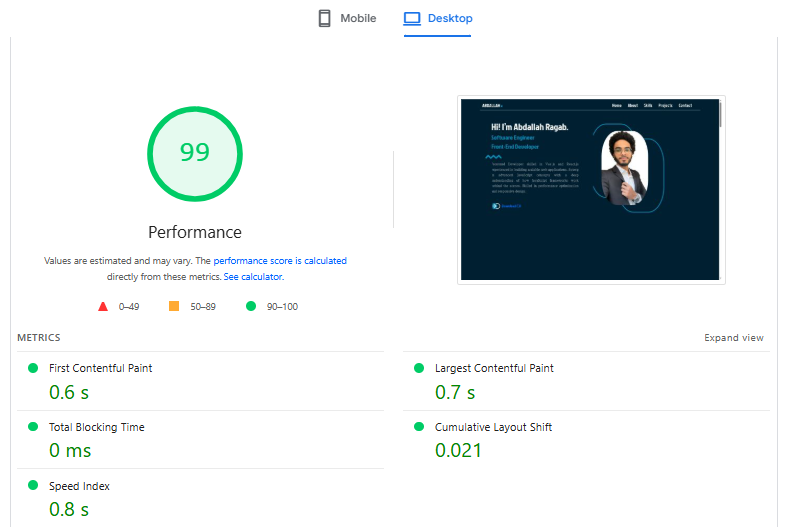

# abdallah-portfolio

### About

My personal website serves as a dynamic and responsive digital portfolio, showcasing my skills, projects, education . the website is built by Vue.js ensuring a seamless and adaptive user experience across a diverse range of screens and devices.

## Performance

This site scores **99** on [Google PageSpeed Insights](https://pagespeed.web.dev/) (desktop).



**Techniques used:**

1. **Optimize LCP** — WebP images and high fetch priority for the above-the-fold hero image.
2. **Faster initial load** — Lazy loading for project images below the fold.
3. **Optimize CLS** — Explicit `width` and `height` on images to reserve layout space.
4. **Reduce render-blocking** — `preconnect` for font origins so fonts start loading earlier.

## Website Link

```
https://abdallah-ragab.vercel.app/
```

## Project setup

```
npm install
```

### Compiles and hot-reloads for development

```
npm run serve
```

### Lints and fixes files

```
npm run lint
```
